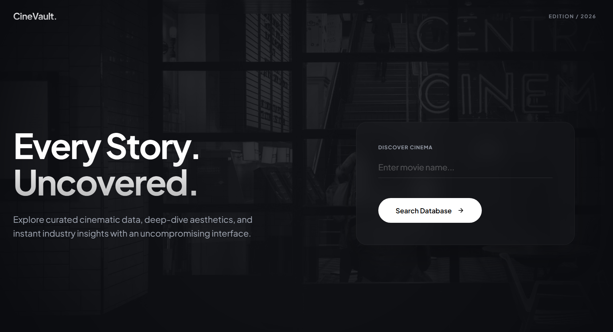
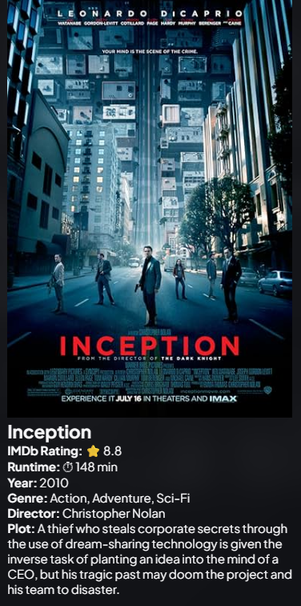

# CineVault

A modern movie discovery web application built using Flask and the OMDb API. CineVault allows users to instantly search for movies and view detailed information including IMDb ratings, runtime, genres, directors, cast, plot summaries, and posters through a clean and responsive interface.

---

## Features

- Search movies by title
- View IMDb ratings and vote counts
- Display runtime, genre, year, and director
- View cast information
- Read plot summaries
- Display official movie posters
- Responsive and modern UI
- Real-time movie data fetched from OMDb API
- Error handling for invalid searches and API failures

---

## Tech Stack

### Backend
- Python
- Flask

### Frontend
- HTML5
- CSS3
- Jinja2 Templates

### APIs
- OMDb API

### Tools
- Git
- GitHub
- VS Code

---

## Project Structure

```text
CineVault/
│
├── app.py
├── requirements.txt
├── README.md
├── .gitignore
│
├── templates/
│   └── index.html
│
├── static/
│   └── style.css
│
└── archive/
    └── main.py
```

---

## Installation

Clone the repository:

```bash
git clone https://github.com/YOUR_USERNAME/CineVault.git
cd CineVault
```

Install dependencies:

```bash
pip install -r requirements.txt
```

Run the application:

```bash
python app.py
```

Open:

```text
http://127.0.0.1:5000
```


---

## Learning Outcomes

This project demonstrates:

- REST API consumption
- Flask web development
- Template rendering using Jinja2
- Form handling
- Error handling
- Responsive frontend development
- Git/GitHub workflow

---

## Live Demo

https://cinevault-3004.onrender.com

---

## Screenshots



